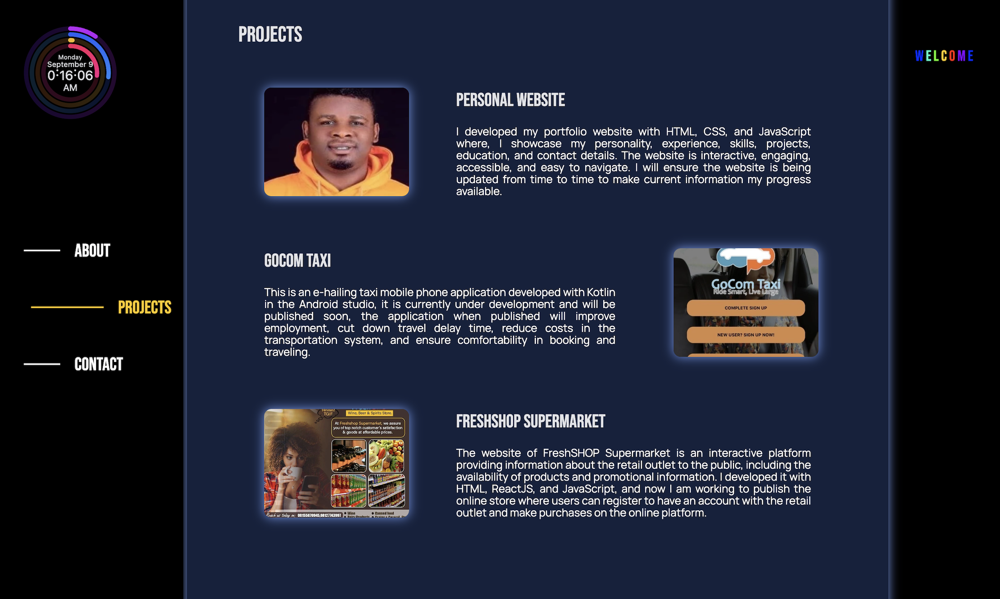
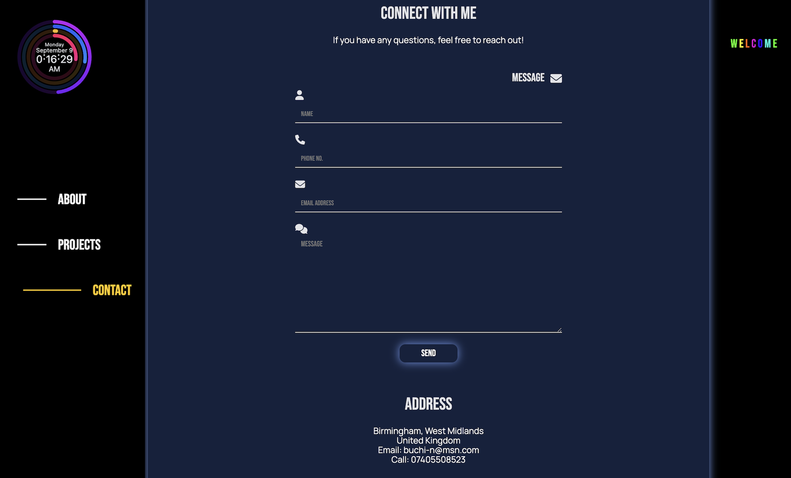

# Personal Portfolio website 

I built this website as point of contact to display my personality, education background, experience, skills as front-end development, projects and contact details.

## Table of Contents

- [Overview](#overview)
- [Built With](#built-with)
- [Features](#features)
- [Contact](#contact)
- [Acknowledgements](#acknowledgements)

## Overview

### Built With

* HTML
* CSS
* JavaScript (ES6)
* Git
* GitHub

## Features

The website will provide youthe necessary information about me, my skills, experience, educational background, projects and contacts details.

## Contact

Here are my social media handle to easily reach me.

- [X](https://x.com/oanizobanwota)
- [Facebook](https://www.facebook.com/oanizobanwota)
- [GitHub](https://github.com/oanizobanwota)
- [Linkedin](https://www.linkedin.com/in/onyebuchi-anizoba-nwota)
- [Instagram](https://www.instagram.com/anizobanwota)

## Acknowledgements

My acknowlegement and appreciations to,

- [Codepen](https://codepen.io/)
- [Google](https://www.google.com/)
- [Jon Kantner](https://speckyboy.com/progress-bars-css-javascript/)
- [Formspree](https://formspree.io/)

for inspiration, materials and tutorials i got from searching through their websites.

### Tips
Buy me a coffee, if you appreciate my efforts. 
Thank you. :thumbsup:

